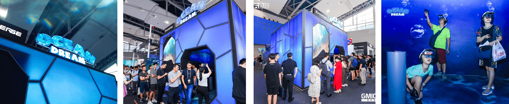
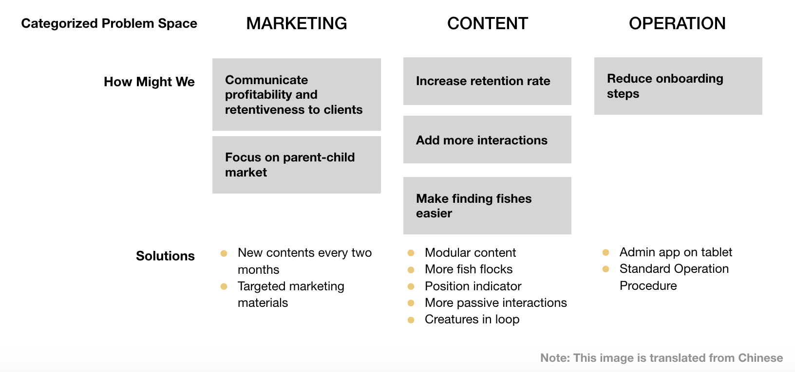
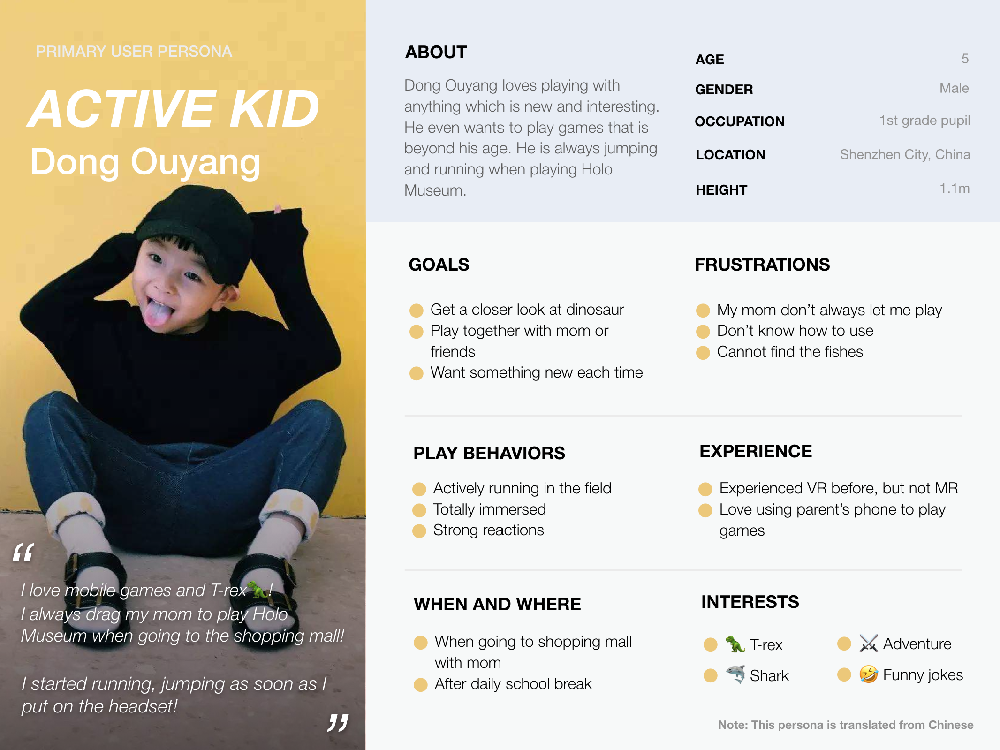
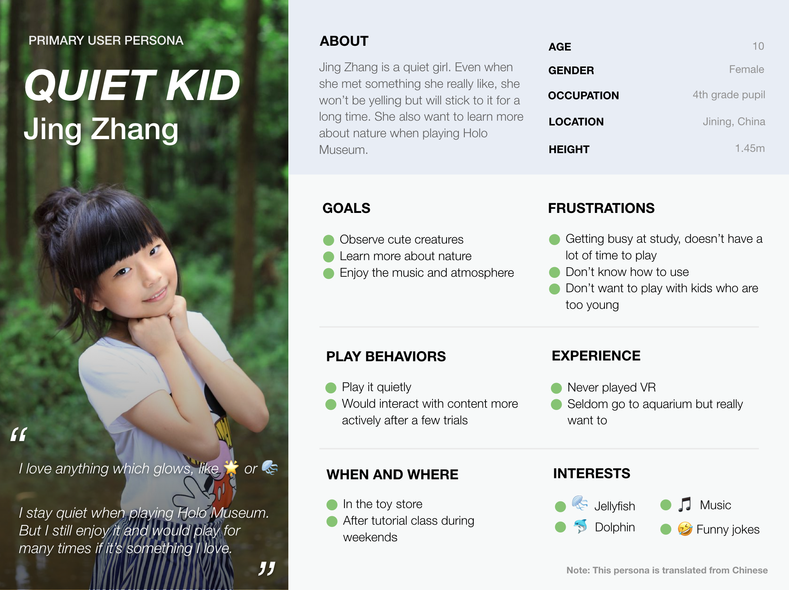
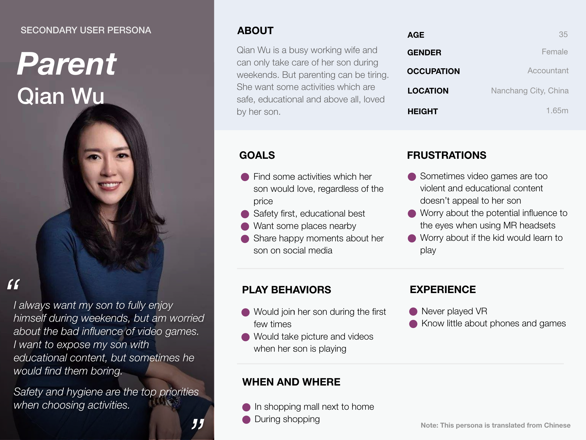
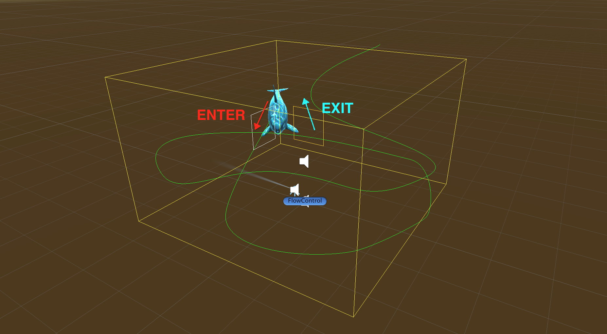
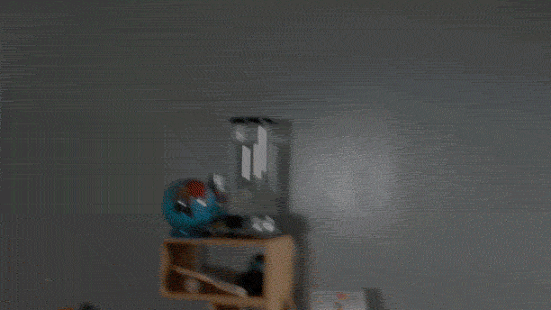

## Overview
Holo Musem is a set of educational MR experiences about nature.There are three chapters (Ocean Dream, Dinosaur World and Forest Fantasy) now and growing. It is the main income source of the company right now.	

## Role
I kickstarted the project with a successful demo. After the expansion of the team, I worked mainly on product managment and UX design.

> I created the initial demo of *Ocean Dream* together with Yanan Qiao(artist) and Juan Carlos(programmer). I led the project and was incharge of the ideation, writting, programming, sound design and so on. After the success of that, three more engineers(Michael Yin, Shuliang Fu and Wayne Huang), one concept artist(Guanjie Xu), one game designer(Jiekai Lin) and one product director(Bingbing Li) were added to the team, along with more art vendors. At that stage, I mainly focused on writing, user research, interaction design and product management.

## Problem
Ximmerse spent over two years developing [Rhino X](http://www.ximmerse.com/index/rhinox/index.html) and LBE (Location based entertainment) became a high-potential field for monetizing the tech. We tried many directions. One of them was [Blaster](./blaster.html) which was acquired by NetEase. But all the other ones(these include one game bought outside and one game developed in house) didn't get great feedback from the pontential buyers.

So weeks before GMIC(where we are going to debut our LBE products), I was given a small team and a task: find a feasible new LBE direction and build a demo for GMIC.

## Solution
I led the creation of Ocean Dream, which is an educational MR experience that immerse viewers into a surreal underwater world where they can touch the jellyfish to spawn music notes and watch the migration of a group of sea turtles.

> The demo was a huge success during GMIC, so we expanded the team and increased the budget to turn it into a product - Holo Museum. We further defined our user group and added two new chapters. Along the way we ran user tests, both internally and in real stores to improve the user experience.
Holo Museum is currently the major income source of Ximmerse now.

## Initial Demo
We were given less than three weeks for GMIC demo. The time limitation really forced us to come up with less features. It also forced us to `plan less and prototype more`. 
After quite some trial and error, eventually we created a underwater story featuring dolphins, sharks, manta rays, turtles and jellyfishes. The story was based on real events of nature with some imaginary touch.

<iframe width="100%" height="500px" src="https://www.youtube.com/embed/PJ6UlATS4Cw" frameborder="0" allow="accelerometer; autoplay; encrypted-media; gyroscope; picture-in-picture" allowfullscreen></iframe>

## Demo Stole the Show
During GMIC, Ocean Dream stole the show. We had so many people waiting that we had to borrow stuff from other booths. We also took the opportunity to observe and interview the users. 

## Problem
During GMIC, it's great that we had many happy visitors, but we **didn't manage to secure many paying clients**(clients who bought our entire solution).

## Data Analysis
So we gathered all the feedbacks from users, team members who observed the users, and stakeholders like marketing department. Then we used `affinity diagram` to sort out the problems. Later that day we hold a brainstorm session to discuss the solutions.

During GMIC, we had a lot of interests but no actual sells. According to the feedbacks, clients were mostly worried about the lack of retention although the experience is innovative and fun. To address this, we made three major changes to the product:

1 . Narrow the target user group down to kids (5-10 years). We found that kids enjoyed it the most during the show.

2 . Expand the product line to three chapters which contain 3 episodes each. And we need to deliver them quickly.

3 . Find a way to modularize the content to speed up developement and enrich the content library faster.

These changes turned out to be critical to the success later on. Apart from them, we also made lots of detailed improvement to polish the content.

## Persona
We didn't know which target audience the content is for. It was really driven by the user feedback. Initially we designed the content for both young people and kids. What turned out is that most audience going to the show was family(GMIC show is open to the citizens) and kids were just enjoying it much more than adults.
Changing the target user group has a profound impact on every aspects of the product, including story, art, branding, etc. We conducted interviews with users who we collected during GMIC show. Then upon the expansion of the team, I invited all team members to create a persona sets for our new product.
<ul class="pgwSlideshow">
    <li></li>
    <li></li>
    <li></li>
</ul>

## Solution One: Content modularization
Enriching our content library as quickly as possible is critical for getting paying clients. 
Firstly, we made sure that all the stories within each chapter is about multiples of 30 seconds. For longer interactive story like dolphin, it could be 90 seconds long while for short swim through like sailfish, it will be 30 seconds long. This allows us to mix up different stories for different episodes with the same total length.

Secondly, we need to make sure that we won't lose users attention during story transitions. It used to happen a lot and users were complaining inability to find fishes. I wrote a script which would re-orient the entrance of the next story to the direction where the user is looking at. But it didn't work because user's head would be rotating and the new creature would still be missed.

Eventually I set a simple rule, which is the next creature would always enter the stage near where the last creature left. For modularization purpose, all the creatures would go in a loop.
<figure class="wide">
    
    <figcaption>Screenshot of Unity showing the loop of a story</figcaption>
</figure>

This simple solution worked very well during user test and users didn't notice the loop at all.

One of the challenges with any XR platform is losing control of the camera. This is one way to keep a [continuous POI(Point of interest) flow](/docs/interaction/poi-flow).

## Solution Two: Object indicator
User's attention can be unpredictable, especially with an active kid. When the kids were running and jumping, sometimes they would lose the target. To help the user out, we tried a widely used UI elements - object indicator.

I quickly tested something simple: a simple arrow with icon indicating the target. The dog-fooding test works fine. But for novice users, they didn't notice the arrow at all. To make it worse, sometimes they would mistook the icon as the **actual object**. For instance, they would think that the meat icon is the meat and they even tried to grab the meat icon.

In the second iteration, I changed the arrow shape to be more recognizable for novice user. I aslo removed the icon and animated the arrow to make it stand out. I organized another round of novice user test and the new design worked.
<figure class="left">
    
    <figcaption>First iteration: simple arrow with icon</figcaption>
</figure>

<figure class="right">
    
    <figcaption>Second iteration: animated arrow</figcaption>
</figure>

## More content
With a well tested foundation, we quickly added two new chapters to Holo Museum.
<figure>
    <iframe width="100%" height="500px" src="https://www.youtube.com/embed/LgErT0ARp8g" frameborder="0" allow="accelerometer; autoplay; encrypted-media; gyroscope; picture-in-picture" allowfullscreen></iframe>
    <figcaption>Shot through Rhino-X optics, Dino World.</figcaption>
</figure>
 
<figure>
    <iframe width="100%" height="500px" src="https://www.youtube.com/embed/ivZA6fJ3agU" frameborder="0" allow="accelerometer; autoplay; encrypted-media; gyroscope; picture-in-picture" allowfullscreen></iframe>
    <figcaption>Shot through Rhino-X optics, Forest Fantasy.</figcaption>
</figure>

## Outcome
To test out the new version of content and feedbacks of real paid customers, we opened a pop-up store in Shenzhen in December 2019. Below is the outcome:

	

		<h4> ¥50000+</h4>
		
Revenue of pop up store

	

	

		<h4> 60%+ </h4>
		

			Visitor2Customer Conversion rate  
			<i>(20% is industry average)</i>
		

	

	

		<h4> 40+ </h4>
		
Headsets sold to business clients

	

After that, Holo Museum became the major product of Ximmerse with more and more content being created for it.

