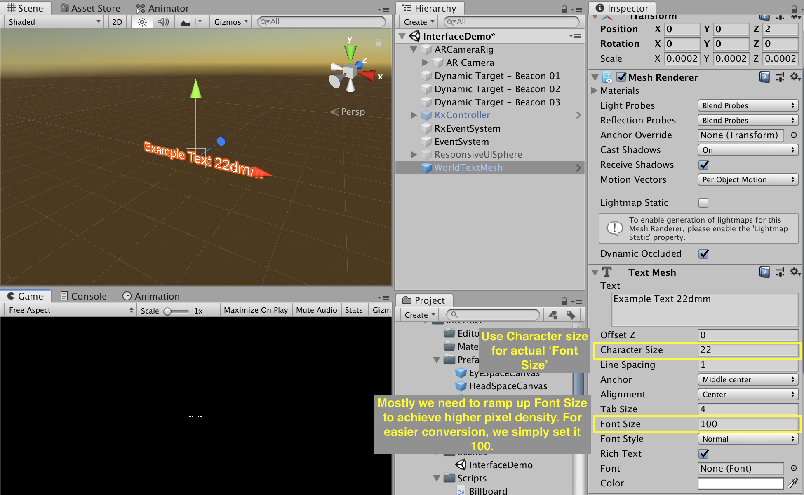

# User Interface

Best UI is no UI at all. This is especially true for MR. UI in MR should be ergonomical, unobtrusive and only appear when it's needed.

## Types of UI

In MR, based on where UI is anchored, UI can be defined as world space, head space and controller space.

|  Word Space   | Head Space  | Eye Space | Controller Space |
|  ----  | ----  | ----  | ----  |
| UI which is anchored to the world. Good for showing information about the world. Usually unobtrusive but can be missed if not carefully placed.  | UI which is anchored to the head. Combined with tag-along, users cannot miss it. Only use it to show absolutely vital information since it can be obtrusive. Ergonomics need to be carefully considered. No ironman's HUD please. | UI which is fixed to the eye. It should be minimal, short and only show essential information. |UI which anchored to the controller. Users can see the UI when they need it by raising the arm. Perfect for a tool palette or bullet counter. 

<!-- Based on whether or not it's integrated to the game's narrative, UI can be defined as non-diegetic UI and diegetic UI. A proper designed diegetic UI would increase illusion. A explanation of definitions can be found in a [Gamasutra article](https://www.gamasutra.com/blogs/AnthonyStonehouse/20140227/211823/User_interface_design_in_video_games.php).

|    Non-diegetic    | Diegetic |
| ----------         | ---      |
|    |   |
| UI which is not part of the game's narrative.  |  UI which is part of the game's narrative. This includes using a scoreboard to show competition stats or a hologram projector to project UI. | -->

## Ergonomics

Ergonomics of UI are fundational principles. It's the bottom line of a useable UI.

### Previous work
There has been quite some research into the size and distance part of spatial UI throughout these years.

Alex Chu from Samsung Research did [research](https://www.youtube.com/XjnHr_6WSqo) on the comfort range of head rotation and how '3D' an object feels at various distances.

<!-- Mike Alger further developed it into zones for content placement and interaction area. He also cited data from [*Visual Ergonomics in the Office*](https://docplayer.net/20715044-Visual-ergonomics-in-the-office.html).

<iframe width="100%" height="400" src="https://www.youtube.com/embed/id86HeV-Vb8" frameborder="0" allow="accelerometer; autoplay; encrypted-media; gyroscope; picture-in-picture" allowfullscreen></iframe> -->

Google invented `dmm` to make it easier to calculate size in spatial, which Ximmerse adopted as well. They also established standards for text (1.375° or about 24dmm) and hit target(For the current gen VR headsets like Oculus Rift, HTC Vive with controller tracking. Not for HoloLens and Magic Leap One).

<iframe width="100%" height="300" src="https://www.youtube.com/embed/ES9jArHRFHQ?start=492" frameborder="0" allow="accelerometer; autoplay; encrypted-media; gyroscope; picture-in-picture" allowfullscreen></iframe>

Unfortunately there are no shared golden rules yet for different XR devices out there since they have different field of view, optical design and angular resolution ([Field of view](http://doc-ok.org/?p=1414) and [angular resolution](https://twitter.com/PalmerLuckey/status/756243796275310593) for headsets even have no established standards). For HoloLens with a high angular resolution, the [minimal text size](https://docs.microsoft.com/zh-cn/windows/mixed-reality/text-in-unity#the-minimum-legible-font-size) is about 0.4° or 7dmm according to their doc. For Magic Leap One, [this number](https://developer.magicleap.com/learn/guides/design-typography) is 8dmm. For Rhino X, the number is 22dmm according to our user test.

### Our study for Rhino X

#### Color standard
In an optical-see-through MR system like Rhino X, light can only be added to the view and black object would be transparent. It's like using `Lighten` layer blending mode in Photoshop.

There is contrast ratio standard like [AAA contrast ratio](https://usecontrast.com/guide) on the screen medium. On MR, it's more challenging to establish such standards since the optics, display brightness and environment brightness can affect the result (Hue and saturation won't affect eligibility).

In our user test for Rhino X in indoor environment, we found that color with under 10% brightness is transparent to the eye and color with 50% brightness and above is eligible. Color with 10% to 50% brightness can be used for semi-dark background but shouldn't be used for text, unless against a bright background. After a while, you see your color picker differently.

#### Line width standard

The angular resolution of lots of XR headsets is small compared to today's mobile phone screen. Because of that, if a line is too thin, it would appear gittering. Designer should be mindful of this when choosing fonts and drawing lines.

Our user tests show that even with the 4x anti-aliasing on, a white line thinner than 3 dmm would appear glitchy, while a blackline on a white background thinner than 2 dmm would appear glitchy. Also, be sure to include one pixel of padding for every border. Because if not, Unity would render it as the border of a mesh, which is much more pixelated.

#### Eye space UI standard
In [Types of UI](#types-of-ui) section, we mentioned eye space UI. It's is used to show info which user **has to** see at the moment, like an important notification or the feedback UI when pressing the hardware volume buttons. The UI can be locked to the head firmly or [tag along](https://docs.microsoft.com/en-us/windows/mixed-reality/billboarding-and-tag-along#what-is-a-tag-along). Designers should be really careful with head space UI.

##### Rules
1. Use it for essentials
2. Use fast tag along when possible
3. Place it in a comfortable region(see the next section).

##### Types
| Types |   Non-interruptive              | Interruptive  |
| ---- | ----------         | --- |
| Usage | Short notification without interrupting the current task   | Notification of the ending of a game |

##### Comfort zones

The following zones are based on user tests which put eye space texts in various regions.

### Rhino X standards cheat sheet

If you are developing for Rhino X, do check out our [MR UI template](https://www.figma.com/file/i9Az94FXnHDCRw09Wlz5lM/daydream_stickersheet_components_20170517?node-id=76%3A380) and [MRUIHelper.unitypackage](https://drive.google.com/file/d/1CxGVXWRHYkHK2gpme-HViuTdVp9NZJ5N/view?usp=sharing) to kickstart your design. The Unitypackage also includes essential scripts like `billboarding`, `auto resize`, `UI docker` etc.

<iframe style="border: none;" width="100%" height="450" src="https://www.figma.com/embed?embed_host=share&url=https%3A%2F%2Fwww.figma.com%2Ffile%2Fi9Az94FXnHDCRw09Wlz5lM%2Fdaydream_stickersheet_components_20170517%3Fnode-id%3D0%253A1" allowfullscreen></iframe>

### How to implement
1. Design your UI with our UI template in Sketch or other vector software

	Be mindful of the standards when designing, especially when it comes to line width and color choice.

2. Export your files into the image files

!> **NOTE** Be sure to export images with one pixel of transparent edge. If not, Unity would render the edge like the edge of a mesh, which is much more aliased.

3. Import the `MRUIHelper.unitypackage`.

4. For head space main UI like a menu, drag `HeadCanvas.prefab` into hierachy. The zones guide has already been included.

?> _TIP_ When placing images, simply click `Set Native Size` button to set the correct width and height!

5. For simple UI element without the need of a canvas, like an annotation in the world space, drag `WorldSprite.prefab`, `WorldTextMesh.prefab` or `WorldTextMeshPro.prefab` into hierachy.

?> _TIP_ When using `WorldTextMesh.prefab` Please use character size for changing font size, and keep character size at 100.

6. For eye space UI canvas, drag `EyeCanvas.prefab` into hierachy.

<!-- ## Responsive MR UI
### Billboarding and tag along
[Billboarding](https://docs.microsoft.com/en-us/windows/mixed-reality/billboarding-and-tag-along#what-is-billboarding) makes UI face you all the time. Billboarding might break your composition since user's position is uncertain. You can use the gizmos helper to check for unwanted clipping or occlusion.

[Tag long](https://docs.microsoft.com/en-us/windows/mixed-reality/billboarding-and-tag-along#what-is-a-tag-along) adds a small delay to the head space UI for comfort. `Billboard.cs` and `TagAlong.cs` are avaliable in `UIHelper.unitypackage`.

### Responsive size

When a world space UI is related to an object, we recommend to use 	the following responsive size pattern to ensure eligibility without breaking composition.  `WorldSpriteWithText.prefab` in `UIHelper.unitypackage` comes with this by default.

|               | Far away  |   Mid range     | Close up  |
| ----------         | ---      |  ----------         | ---      |
| Distance  | >5m    |  1 to 5m | <1m |
| Style  |  Hide or show a dot    | Constant angular size    | Constant actual size and fade away when <30cm |
| Video  |     |     |  |
 -->

<!-- ## Others

### Linear color space problem of Unity
Transparent UI won't render properly when [linear color space is checked in Unity](https://cmwdexint.com/2019/05/30/3d-scene-need-linear-but-ui-need-gamma/). Use the shader in `LinearCorlorSpaceUIFix.unitypackage` to fix it.

 -->

## Future of 3D UI

