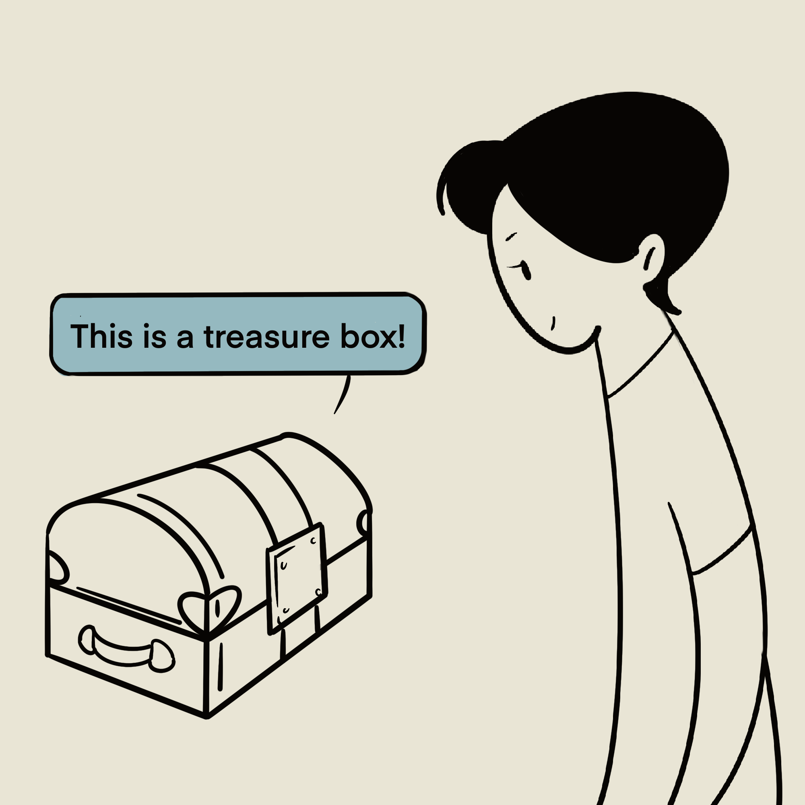
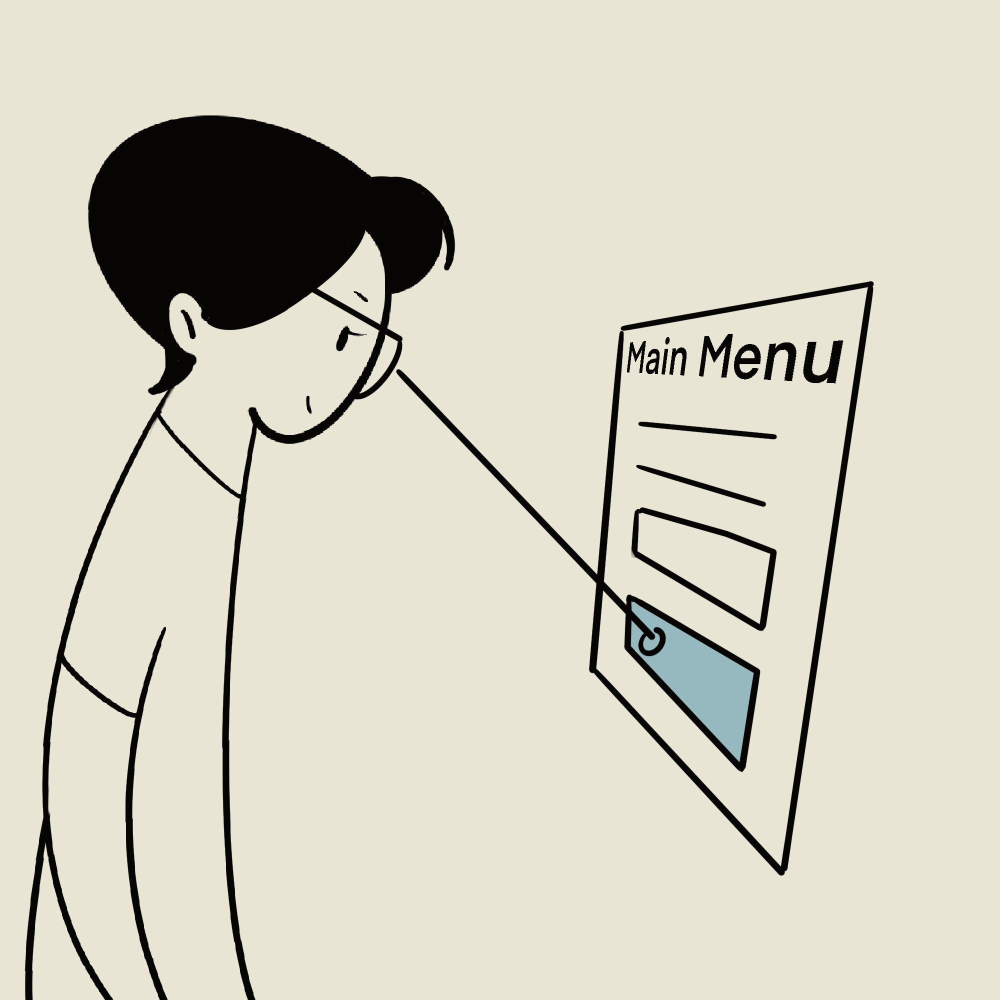
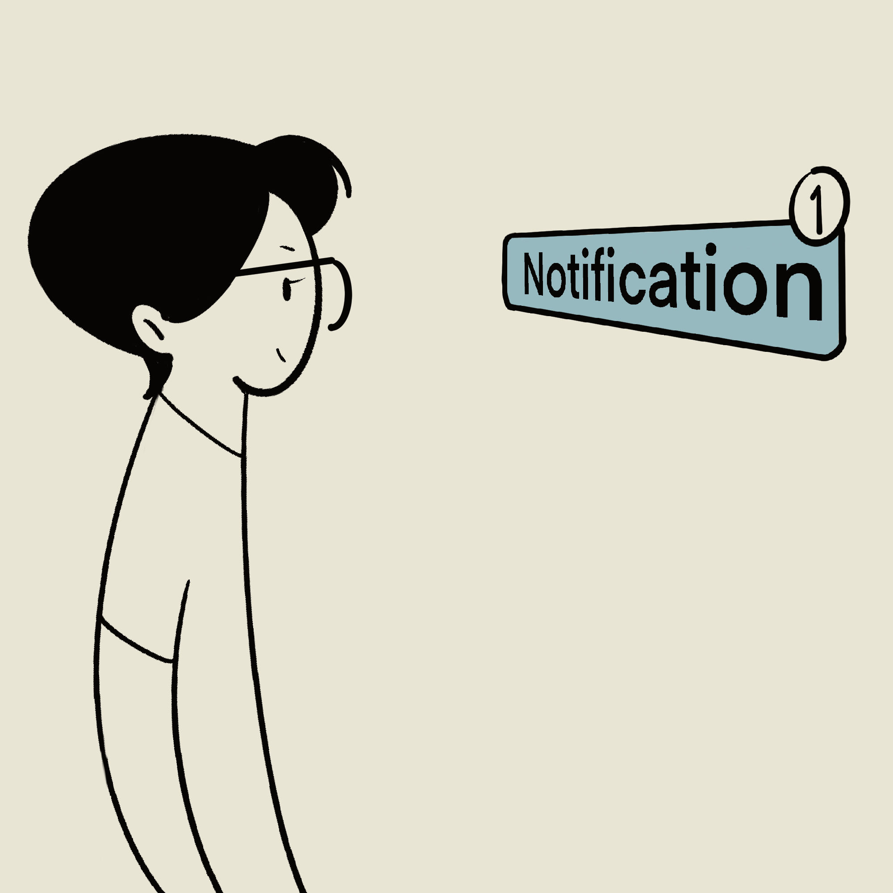
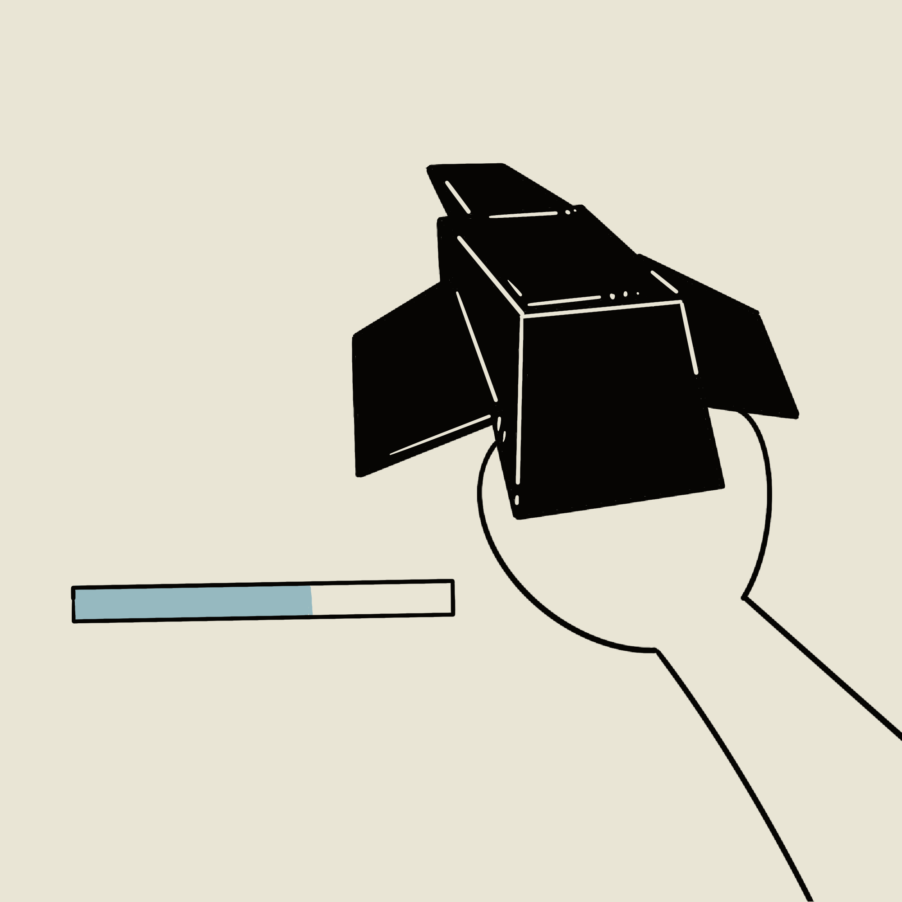
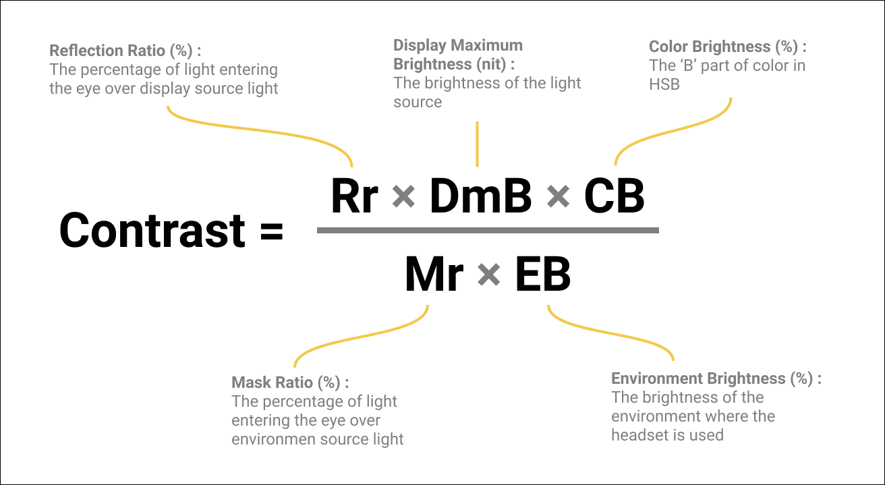
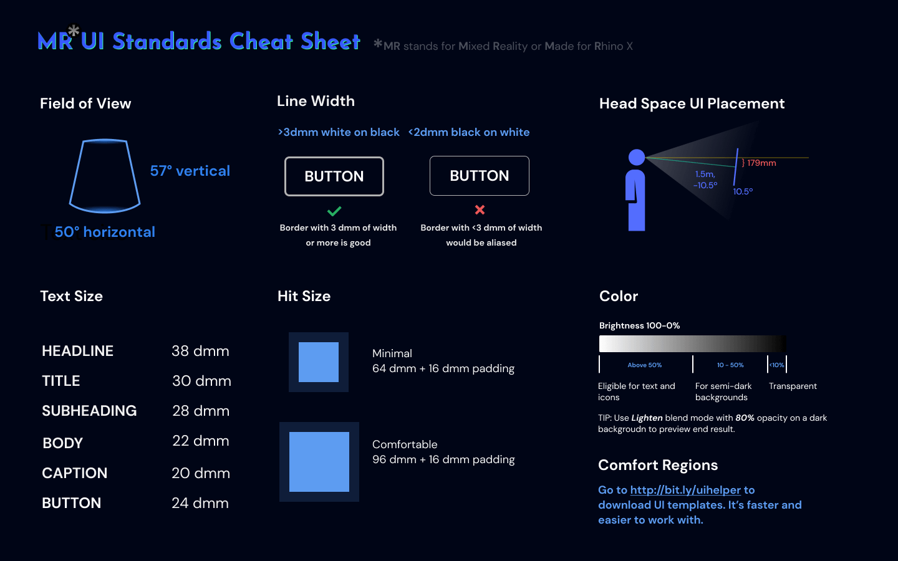
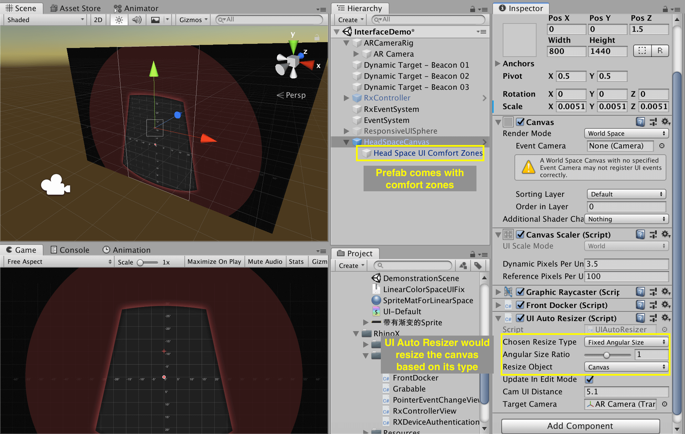
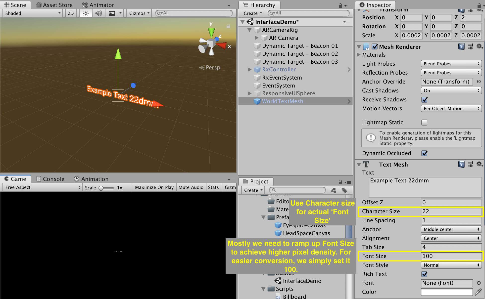

# 用户界面

最佳的UI（用户界面）就是根本没有UI。这对于MR来说尤其正确。MR中的UI应该符合人机工学、不打扰用户，并只在它真正被需要的时候出现。

## UI的类型

MR中，我们根据UI所处的位置将UI划分为世界空间、头部空间、眼部空间和手柄空间。之所以这么分，是因为不同空间的UI有着截然不同的适用范围和人机要求。

|  世界空间   | 头部空间  | 眼部空间 | 手柄空间 |
|  ----  | ----  | ----  | ----  |
|     |    |   |   |
| 锚定在世界坐标的UI。很适合显示与世界中物体相关的信息。通常不会打扰用户但如果没有精心放置的话用户可能会察觉不到。| 位置锚定在头部，但用户可以旋转查看UI的不同区域。结合延迟跟随（tag-along），用户一定能够察觉到这种UI。建议仅用它来显示必要的信息，且不要常显。此类UI需要遵循较严格的人机要求。| 固定在眼部空间。用户无法旋转头部来查看UI的不同区域因为UI与眼睛的相对位置是固定的。因此这类UI只能用于显示重要、简短的通知类信息，且不能常显。| 锚定在手柄空间的UI。当用户抬起手就能看到。很适合用于显示一个工具面板或是子弹计数器。

## 人机工程学

UI的人机工程学是基础性的原则。它是一个可用的UI的底线。

### 前人的工作
这些年对于空间UI的大小和距离已经有了不少研究和规范的产出。

三星研究院的Alex Chu研究了[头部旋转的舒适度范围和UI在不同距离的舒适度](https://www.youtube.com/XjnHr_6WSqo)。

<!-- Mike Alger further developed it into zones for content placement and interaction area. He also cited data from [*Visual Ergonomics in the Office*](https://docplayer.net/20715044-Visual-ergonomics-in-the-office.html).

<iframe width="100%" height="400" src="https://www.youtube.com/embed/id86HeV-Vb8" frameborder="0" allow="accelerometer; autoplay; encrypted-media; gyroscope; picture-in-picture" allowfullscreen></iframe> -->
谷歌发明了 `dmm` 来更好地描述空间中的尺度（视频见下）。我们觉得这是个很好的想法，也在项目中进行了应用。他们也为文字的尺寸（1.375°或约 24 dmm）和按钮的尺寸（64 dmm）制定了标准。注意这些标准是针对诸如Oculus Rift CV和HTC Vive这样的本世代的VR头显，而不是针对HoloLens 和Magic Leap One这样的高角分辨率AR头显。

<iframe width="100%" height="300" src="https://www.youtube.com/embed/ES9jArHRFHQ?start=492" frameborder="0" allow="accelerometer; autoplay; encrypted-media; gyroscope; picture-in-picture" allowfullscreen></iframe>

现在的VR和MR头显的规格比较碎片化。每个设备都有其特有的视场角、光学特性和角分辨率（[视场角](http://doc-ok.org/?p=1414)和[角分辨率](https://twitter.com/PalmerLuckey/status/756243796275310593)甚至还没有一个通用的计算标准）。对于[HoloLens](https://docs.microsoft.com/zh-cn/windows/mixed-reality/text-in-unity#the-minimum-legible-font-size) ，官方推荐的最小文字尺寸约为0.4° 或 7 dmm。对于[Magic Leap One](https://developer.magicleap.com/learn/guides/design-typography)，官方推荐的最小文字尺寸为8 dmm。对于Rhino X，我们推荐的最小文字尺寸为22 dmm。

### 我们的工作

#### 色彩标准
在一个光学穿透MR系统中，光只能添加到视野里而黑色物体就是透明的。就像在Photoshop中使用`减淡`的图层混合模式一样。

在PC或移动端，已经有诸如[AAA对比度值](https://usecontrast.com/guide)的色彩对比度标准。在MR领域，创立这样的标准要困难得多，因为光学、显示亮度、环境亮度都会对实际人眼感受到的显示内容的对比度有很大影响。 (注意色调和饱和度几乎不会影响可读性).

在我们针对室内环境的基于Rhino X的用户测试中，我们发现：低于10%亮度的颜色基本为透明；在10%到50%亮度之间的颜色可以被感知，但不应用于文字这类需要高对比度的元素（除非放在一个亮色背景上）；高于50%亮度的颜色的对比度则是足够的。

为MR的UI设计多乐，你脑海中的调色盘就会变成像下面这样：

#### 线宽标准

与现在的手机视网膜屏幕相比，现在很多的XR头显的角分辨率都偏低。因此，如果一条线过细，它会在视野中显得锯齿感很强（除非开极高的抗锯齿，但移动端往往无法支持）。设计师应在选择字体和描绘线条时注意这一点。

我们的用户测试显示，即使使用4x的抗锯齿，宽度低于3dmm的白色线条也会显得锯齿感很强，而宽度低于2mm的黑色线条（在白色背景之上）会显得锯齿感很强。同时，注意为所有UI元素边缘添加一个像素的出血间隔。如果没有的话，游戏引擎往往会将其渲染成为mesh的边界，其锯齿感会更加严重。

#### 眼部空间UI标准
在[UI类型]()一节中，我们提到了眼部空间UI。它用于显示一些用户当前**必须**要看到的信息，例如一条重要的通知或是点击音量加减按钮后的反馈UI。这些UI一般固定在头部空间，不受头部旋转和移动的影响。设计师对于头部空间UI应该多加小心。

##### 规则
1. 仅用于显示当前必要的信息
2. 将其放在一个舒适的位置（[见下]()）

##### 类型
| 类型 |  非阻断式              | 阻断式  |
| ---- | ----------         | --- |
| 用法 | 简短的，不会打断当前操作的通知类信息（类似于移动端的toast）  | 会打断当前操作的信息，如游戏结束的提示语  |

##### 舒适区域
以下的舒适区域是通过用户测试得出的，针对Rhino X：

### Rhino X standards cheat sheet

If you are developing for Rhino X, do check out our [MR UI template](https://www.figma.com/file/i9Az94FXnHDCRw09Wlz5lM/daydream_stickersheet_components_20170517?node-id=76%3A380) and [MRUIHelper.unitypackage](https://drive.google.com/file/d/1CxGVXWRHYkHK2gpme-HViuTdVp9NZJ5N/view?usp=sharing) to kickstart your design. The Unitypackage also includes essential scripts like `billboarding`, `auto resize`, `UI docker` etc.

<iframe style="border: none;" width="100%" height="450" src="https://www.figma.com/embed?embed_host=share&url=https%3A%2F%2Fwww.figma.com%2Ffile%2Fi9Az94FXnHDCRw09Wlz5lM%2Fdaydream_stickersheet_components_20170517%3Fnode-id%3D0%253A1" allowfullscreen></iframe>

### How to implement
1. Design your UI with our UI template in Sketch or other vector software

	Be mindful of the standards when designing, especially when it comes to line width and color choice.

2. Export your files into the image files

!> **NOTE** Be sure to export images with one pixel of transparent edge. If not, Unity would render the edge like the edge of a mesh, which is much more aliased.

3. Import the `MRUIHelper.unitypackage`.

4. For head space main UI like a menu, drag `HeadCanvas.prefab` into hierachy. The zones guide has already been included.

?> _TIP_ When placing images, simply click `Set Native Size` button to set the correct width and height!

5. For simple UI element without the need of a canvas, like an annotation in the world space, drag `WorldSprite.prefab`, `WorldTextMesh.prefab` or `WorldTextMeshPro.prefab` into hierachy.

?> _TIP_ When using `WorldTextMesh.prefab` Please use character size for changing font size, and keep character size at 100.

6. For eye space UI canvas, drag `EyeCanvas.prefab` into hierachy.

<!-- ## Responsive MR UI
### Billboarding and tag along
[Billboarding](https://docs.microsoft.com/en-us/windows/mixed-reality/billboarding-and-tag-along#what-is-billboarding) makes UI face you all the time. Billboarding might break your composition since user's position is uncertain. You can use the gizmos helper to check for unwanted clipping or occlusion.

[Tag long](https://docs.microsoft.com/en-us/windows/mixed-reality/billboarding-and-tag-along#what-is-a-tag-along) adds a small delay to the head space UI for comfort. `Billboard.cs` and `TagAlong.cs` are avaliable in `UIHelper.unitypackage`.

### Responsive size

When a world space UI is related to an object, we recommend to use 	the following responsive size pattern to ensure eligibility without breaking composition.  `WorldSpriteWithText.prefab` in `UIHelper.unitypackage` comes with this by default.

|               | Far away  |   Mid range     | Close up  |
| ----------         | ---      |  ----------         | ---      |
| Distance  | >5m    |  1 to 5m | <1m |
| Style  |  Hide or show a dot    | Constant angular size    | Constant actual size and fade away when <30cm |
| Video  |     |     |  |
 -->

<!-- ## Others

### Linear color space problem of Unity
Transparent UI won't render properly when [linear color space is checked in Unity](https://cmwdexint.com/2019/05/30/3d-scene-need-linear-but-ui-need-gamma/). Use the shader in `LinearCorlorSpaceUIFix.unitypackage` to fix it.

 -->

## Beyond WIMP(Window-Icon-Menu_Pointer) 
The UI mentioned in this page are still using the WIMP metaphor with raycast(Head gaze or hand ray). WIMP will still be important in MR because there still will be a lot of `abstract concept models` in MR applications. But just like touch gestures add a new dimension to the mobile platform, there are huge opportunities for novel interaction techniques. Some would increase usability while some would make the UI more delightful to use.

### Spatial gestures
One of the most exciting areas of 3D UI is spatial gestures. Drag-and-drop, kinematic scrolling and pinch-to-zoom are great gestures which are usable and delightful at the same time. Right now, two-hand-pinch-to-scale and toss-to-delete are examples of spatial gestures that are becoming standards.

### Spatial widgets
Some VR games use no GUI(Graphical User Interface) at all. Instead, they designed novel spatial widgets for some tasks. Although not all the ideas are more efficient or easier to understand, some of them will be adapted as standards(Putting catridge into the slot to start a game is becoming a standard in VR games).

### Tools from real world
For applications with a strong real world counterpart, like white board app,  designers can eliminate of most UI by replicating the real pen, real eraser and real whiteboard.

### Z-depth
Z-depth can be a great opportunity for increasing the display volume. And our brain is good at memorizing spatial relationships. One good example is [selecting pictures from a stack](https://youtu.be/lGUmTQgbiAY?t=488).
<video width="100%" autoplay loop muted  src="videos/Daydream_Labs_Selecting%20photos.mp4"></video>

### 3D
Simply making every UI elements 3D usally won't help with the readbility. But this can be a different art style.  For games, it's another story because 3D UI can contribute the immersion of the narritive like [Metro series](https://medium.com/@thewanderlust/considering-the-narrative-in-user-interface-design-for-video-games-c45953c22760). 

Currently, creating 3D UI elements takes much longer time than 2D ones since the toolchain is not ready.

### Materiality
UI design utilizes color, highlight, shadow to build hierachy in UI. In MR, UI is inside a 3D engine, so there are opportunities to use the rendering power of the 3D engine to create novel looking UIs.

